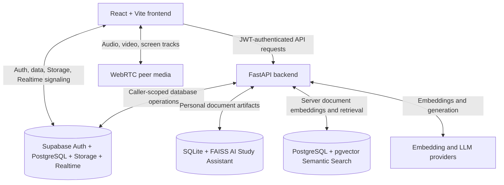

# StudyCord

[StudyCord](https://www.studycord.me/) is an AI-powered student collaboration platform that brings group communication, shared study resources, semantic document search, and document-grounded AI study tools into one workspace.

Students can organize communities into servers and channels, exchange messages and files in real time, join voice or video calls, share a screen, search supported server documents by meaning, and turn selected study material into grounded questions, summaries, flashcards, and revision quizzes.

**Website:** [www.studycord.me](https://www.studycord.me/)

## Feature overview

- **Servers and channels** — organized study spaces with ordered text and voice channels.
- **Realtime messaging** — channel conversations, attachments, message moderation, and pinned messages.
- **Roles and moderation** — owner, administrator, and member permissions; invitations, bans, member management, and ownership transfer.
- **Voice and video** — WebRTC calls with presence, microphone and camera controls, STUN, and TURN fallback.
- **Screen sharing** — display video with optional system audio when the browser supports it.
- **Document sharing** — channel attachment previews, downloads, and server resource discovery.
- **Semantic search** — server-scoped pgvector retrieval over validated PDF, DOCX, and TXT resources.
- **AI Study Assistant** — personal document Q&A, summaries, flashcards, revision quizzes, session history, and resource handoff.
- **Authentication** — email/password, Google OAuth, password recovery, and protected application routes through Supabase Auth.
- **Persistent study history** — local RAG metadata and artifacts on the backend plus IndexedDB chat and generated-output history in the browser.

More detail is available on the public [Features](https://www.studycord.me/features) and [Technology](https://www.studycord.me/technology) pages.

## Screenshots

> Screenshots are intentionally left as placeholders until a stable, sanitized production capture set is prepared.

| Area | Preview |
| --- | --- |
| Study workspace | `docs/screenshots/study-workspace.png` |
| AI Study Assistant | `docs/screenshots/ai-study-assistant.png` |
| Advanced Search | `docs/screenshots/advanced-search.png` |
| Voice and video channel | `docs/screenshots/voice-channel.png` |

## Architecture overview

StudyCord keeps signaling, application requests, persistent collaboration data, live media, and AI retrieval in separate layers.



### Request and security boundaries

- The browser uses the Supabase anonymous key and the authenticated user session.
- FastAPI validates the Supabase bearer token before protected operations.
- Server permissions reuse the current owner, administrator, and member authorization model.
- Caller-scoped database operations retain the user JWT so existing RLS remains active.
- Trusted backend credentials are limited to server operations that require them, such as controlled Storage access and indexing writes. They are never exposed to the frontend.
- WebRTC media does not travel through FastAPI or PostgreSQL. Supabase-backed signaling and presence only help peers establish and maintain a connection.

## Tech stack

### Frontend

- React 19
- Vite 8
- React Router
- Supabase JavaScript client
- Axios
- Framer Motion
- React Markdown
- dnd-kit
- IndexedDB for local study history

### Backend

- Python and FastAPI
- Pydantic
- HTTPX
- LangChain integrations
- Pillow, pypdf, and python-docx

### Database

- Supabase PostgreSQL
- PostgreSQL Row Level Security

### Authentication

- Supabase Auth
- Email and password
- Google OAuth

### Realtime

- Supabase Realtime
- Database-backed call presence and signaling

### Storage

- Supabase Storage
- Backend-controlled file validation where required

### Voice and video

- WebRTC
- STUN
- Metered TURN

### Personal AI

- FAISS
- SQLite
- Google GenAI embedding integrations
- Provider-neutral NVIDIA NIM and OpenRouter generation layer

### Semantic Search

- Supabase PostgreSQL
- pgvector
- HNSW vector indexing
- Cosine similarity

### Deployment

- Vercel
- Render
- Supabase

## Project structure

```text
StudyCord/
├── Frontend/
│   ├── public/              # Crawl files, manifest, icons, and static assets
│   ├── src/
│   │   ├── components/      # Product UI and shared public-page components
│   │   ├── hooks/           # Voice and WebRTC session behavior
│   │   ├── lib/             # Supabase, API, auth, search, and IndexedDB utilities
│   │   ├── pages/           # Authenticated, authentication, and public routes
│   │   └── routes/          # Protected route handling
│   └── tests/               # Frontend behavior and regression tests
├── Backend/
│   ├── evaluation/          # AI quality evaluation tooling and dataset template
│   ├── llm/                 # Provider abstraction and NVIDIA/OpenRouter manager
│   ├── migrations/          # Forward Supabase SQL migrations
│   ├── tests/               # Backend unit, security, and regression tests
│   ├── main.py              # FastAPI application and endpoint composition
│   └── requirements.txt
└── README.md
```

## Installation

### Prerequisites

- Node.js 18 or newer
- npm
- Python compatible with the pinned backend dependencies
- A Supabase project with the required schema and Storage configuration
- Provider credentials for the AI and TURN features you intend to test

### Clone and install the frontend

```bash
git clone https://github.com/Basilisk2061/StudyCord.git
cd StudyCord/Frontend
npm install
```

### Create a backend environment

```bash
cd ../Backend
python -m venv .venv
```

Activate the virtual environment for your shell, then install dependencies:

```bash
pip install -r requirements.txt
```

## Environment variables

Do not commit `.env` files, API keys, JWTs, or service-role credentials.

### Frontend

Create `Frontend/.env.local` as needed:

```env
VITE_SUPABASE_URL=https://your-project.supabase.co
VITE_SUPABASE_ANON_KEY=your_public_anon_key
VITE_API_BASE_URL=http://127.0.0.1:8000
VITE_AUTH_REDIRECT_ORIGIN=http://localhost:5173
```

| Variable | Purpose | Requirement |
| --- | --- | --- |
| `VITE_SUPABASE_URL` | Supabase project URL | Required |
| `VITE_SUPABASE_ANON_KEY` | Public browser key used with RLS | Required |
| `VITE_API_BASE_URL` | FastAPI origin; blank uses the Vite same-origin proxy | Deployment dependent |
| `VITE_AUTH_REDIRECT_ORIGIN` | Explicit OAuth/recovery origin | Optional; defaults to browser origin |

### Backend

Create `Backend/.env`:

```env
SUPABASE_URL=https://your-project.supabase.co
SUPABASE_ANON_KEY=your_anon_key
SUPABASE_SERVICE_ROLE_KEY=your_server_only_service_role_key

GEMINI_API_KEY=your_google_ai_key

NVIDIA_API_KEY=your_nvidia_key
NVIDIA_MODEL=your_nvidia_model
PRIMARY_LLM_PROVIDER=nvidia

OPENROUTER_API_KEY=your_openrouter_key
OPENROUTER_MODEL=your_openrouter_model
FALLBACK_LLM_PROVIDER=openrouter

METERED_DOMAIN=your-metered-domain
METERED_SECRET_KEY=your_metered_secret

ALLOWED_ORIGINS=http://localhost:5173,https://www.studycord.me
```

| Variable | Purpose | Requirement |
| --- | --- | --- |
| `SUPABASE_URL` | Supabase REST and Storage origin | Required |
| `SUPABASE_ANON_KEY` | Caller-scoped Supabase requests | Required |
| `SUPABASE_SERVICE_ROLE_KEY` | Trusted backend Storage/indexing operations | Required for affected features; backend only |
| `GEMINI_API_KEY` | Embeddings; mapped to `GOOGLE_API_KEY` for integrations | Required for document ingestion and search |
| `NVIDIA_API_KEY` | Primary LLM provider authentication | Required when NVIDIA is primary |
| `NVIDIA_MODEL` | NVIDIA model identifier | Required when NVIDIA is primary |
| `PRIMARY_LLM_PROVIDER` | Primary generation provider | Optional; defaults to `nvidia` |
| `OPENROUTER_API_KEY` | OpenRouter fallback authentication | Required when fallback is enabled |
| `OPENROUTER_MODEL` | OpenRouter model identifier | Optional default exists |
| `FALLBACK_LLM_PROVIDER` | Fallback generation provider | Optional; defaults to `openrouter` |
| `METERED_DOMAIN` | TURN provider domain | Optional default exists |
| `METERED_SECRET_KEY` | Creates short-lived TURN credentials | Required for TURN fallback |
| `ALLOWED_ORIGINS` | Comma-separated FastAPI CORS allowlist | Optional defaults exist; configure in production |

## Running locally

Start FastAPI from `Backend/`:

```bash
uvicorn main:app --host 0.0.0.0 --port 8000 --reload
```

Start Vite from `Frontend/`:

```bash
npm run dev
```

Open the URL reported by Vite, normally `http://localhost:5173`.

### Validation commands

```bash
# Frontend
cd Frontend
npm test
npm run build

# Backend
cd ../Backend
python -m pytest
python -m compileall .
```

## Deployment

The production frontend is hosted on Vercel at [www.studycord.me](https://www.studycord.me/). The FastAPI service runs on Render, while shared authentication, database, Storage, Realtime, and vector data use Supabase.

Production deployment requires:

1. Vercel SPA rewrites so React Router paths resolve to `index.html`.
2. Public frontend environment variables configured in Vercel.
3. Backend secrets configured only in Render.
4. `ALLOWED_ORIGINS` containing the production frontend origin.
5. Supabase Auth redirect URLs for the production OAuth and password-recovery routes.
6. Reviewed migrations applied manually to the intended Supabase project.
7. Persistent backend storage if personal AI study artifacts must survive service replacement.

## AI architecture

All generation endpoints use a provider manager instead of instantiating OpenRouter directly. The current configuration attempts NVIDIA NIM first. OpenRouter is used only for eligible transient conditions such as timeouts, connection failures, rate limits, quota exhaustion, and selected upstream `5xx` responses. Invalid credentials, malformed requests, and programming errors do not silently fall back.

The same provider-neutral layer supports chat answers, summaries, flashcards, quizzes, and MCQs without changing endpoint response shapes or prompts.

## AI Study Assistant

The AI Study Assistant is a personal document study tool. An authenticated user can upload a PDF, DOCX, or TXT document, ask document-grounded questions, generate summaries, create flashcards, and build practice quizzes.

It uses Retrieval-Augmented Generation (RAG): StudyCord extracts and chunks the selected document, creates Google embeddings, stores a personal FAISS index with SQLite metadata, retrieves relevant passages, and gives those passages to the configured language model as context. Ownership checks protect document restoration, and session history and generated study outputs can be reopened through the existing interface.

An authorized shared server resource can be opened as a personal AI study session without exposing arbitrary Storage paths to the browser.

## Semantic Document Search

Semantic Document Search is an independent server resource discovery system. It searches supported documents shared within the current server by meaning rather than relying only on filenames or exact keywords.

The backend validates PDF, DOCX, and TXT content, extracts text, creates embeddings, and stores document chunks in Supabase PostgreSQL with pgvector. HNSW vector indexing and cosine similarity retrieve semantically relevant documents and matching snippets.

Authorization happens before query embedding. Search uses the caller's authenticated Supabase context, excludes non-ready or non-server-visible resources, and does not expose embeddings or Storage paths. Semantic Document Search does **not** generate answers from retrieved documents. It returns search results for users to inspect, and it remains independent from the personal AI Study Assistant. Community ratings are displayed separately and do not change semantic relevance ordering.

## Voice and video

Voice channels use one `RTCPeerConnection` per remote participant. Supabase-backed participant presence and signaling records exchange offers, answers, and ICE candidates. Microphone and camera tracks are attached to peer connections, while remote tracks are assembled into media streams in the frontend.

STUN is used to discover direct connection paths. When direct connectivity is not possible, FastAPI returns short-lived Metered TURN credentials to the authenticated frontend. Screen sharing replaces the outgoing video track and can add a separate optional system-audio track without replacing the microphone sender.

## Authentication

Supabase Auth supports:

- email and password sign-up and sign-in;
- Google OAuth with a dedicated callback route;
- password recovery and reset sessions;
- persisted browser sessions;
- bearer-token forwarding to FastAPI;
- protected dashboard and profile routes.

Database authorization remains separate from login. PostgreSQL RLS, grants, server roles, permission helpers, and scoped RPCs determine which authenticated operations are allowed.

## Database and Storage

Supabase PostgreSQL stores shared application state such as profiles, servers, members, roles, channels, messages, attachments, resources, ratings, pins, bans, and WebRTC presence/signaling records. Forward migrations in `Backend/migrations/` capture the repository-managed schema changes.

Supabase Storage holds avatars, server icons, and channel files. Trusted backend Storage operations perform server-side validation and path generation where required. Personal AI Study Assistant metadata and FAISS artifacts remain local to the backend, while Semantic Document Search embeddings remain in the server-scoped PostgreSQL resource schema.

## Roadmap

Potential future work is tracked conservatively and is not a promise of delivery:

- expand public product documentation and sanitized screenshots;
- improve durable production storage and operational monitoring for the AI Study Assistant;
- add broader automated accessibility and browser coverage;
- evaluate retrieval quality with larger representative datasets;
- continue performance work for large study servers and resource collections.

## Project status

StudyCord is under active development. Features and documentation evolve over time. Always prefer the official website and GitHub repository over third-party descriptions.

## Founding Developers

StudyCord was founded and developed by:

- Arya Dahal
- Bigyan Budhathoki
- Madan Rayamajhi

The project was originally developed as a university capstone project and continues to be actively maintained and improved by its founding developers. The repository does not assign separate public responsibilities to individual founders, so their shared role is documented consistently as Founding Developers of StudyCord.

Learn more on the [StudyCord Team page](https://www.studycord.me/team).

Contributions should preserve authentication boundaries, RLS behavior, user ownership, and the separation between the personal AI Study Assistant and server Semantic Document Search. Review existing tests and migration conventions before proposing changes.

## Website and documentation

- [StudyCord](https://www.studycord.me/)
- [Features](https://www.studycord.me/features)
- [About](https://www.studycord.me/about)
- [Technology](https://www.studycord.me/technology)
- [Team](https://www.studycord.me/team)
- [FAQ](https://www.studycord.me/faq)
- [Privacy Policy](https://www.studycord.me/privacy)
- [Terms of Service](https://www.studycord.me/terms)

## License

A standalone license file is not currently included in this repository. Until an explicit license is added by the project owners, no license grant should be assumed.
